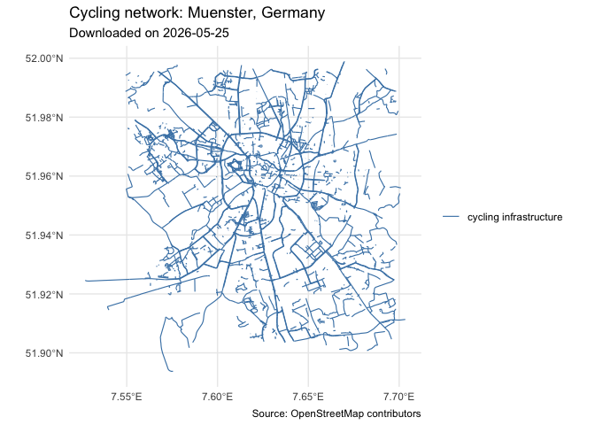
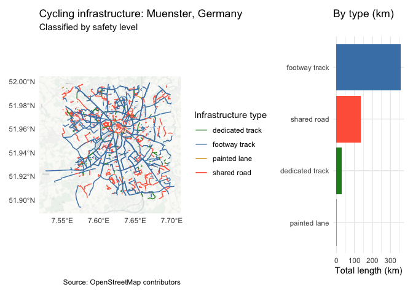

# Cycling Infrastructure Analysis (assignment1)

<!-- badges: start -->

<!-- badges: end -->

The goal of this package is to download, classify, and visualize cycling
infrastructure data from OpenStreetMap. It builds spatial cycling
networks, classifies infrastructure by safety type, computes summary
statistics, and produces maps and plots for analysis.

## Installation

You can install the development version of assignment1 from
[GitHub](https://github.com/) with:

``` r

devtools::install_github("al415615/assignment1")```

## Example

This is a basic example which shows you how to solve a common problem:


``` r
library(assignment1)

# Download cycling network
net <- get_cycling_network("Muenster, Germany")
#> Loading cached data for:  Muenster, Germany

# Print and plot network
net
#> cycling_network object
#>   City         : Muenster, Germany 
#>   Download date: 2026-05-25 
#>   Network lines: 4715 segments
#>   CRS          : EPSG:4326
plot(net)
```



``` r

# Classify infrastructure
classif <- classify_bike_infrastructure(net)

# Print and plot classification
classif
#> cycling_classification object
#>   City         : Muenster, Germany 
#>   Download date: 2026-05-25 
#>   Segments     : 4715 
#> 
#> Infrastructure summary:
#> 
#> 
#> |infra_type      | total_length_km|
#> |:---------------|---------------:|
#> |footway track   |          357.57|
#> |shared road     |          135.98|
#> |dedicated track |           30.34|
#> |painted lane    |            1.82|
plot_cycling_safety_map(classif)
#> 
#> Infrastructure summary for Muenster, Germany :
#> 
#> 
#> |infra_type      | total_length_km|
#> |:---------------|---------------:|
#> |footway track   |          357.57|
#> |shared road     |          135.98|
#> |dedicated track |           30.34|
#> |painted lane    |            1.82|
#> Zoom: 13
```



<!-- badges: start -->

<!-- badges: end -->

This package was developed as part of a university assignment on spatial
data analysis and cycling infrastructure accessibility.
