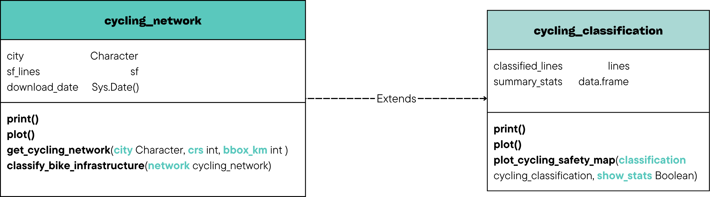

```{r setup, include=FALSE}
knitr::opts_chunk$set(echo = TRUE)
```


# Task 1: Project Concept

## Package theme

This package is meant to be a software tool centered in the urban cycling infrastructure using spatial data. It is available for anyone interested to download, classify and even visualize the bike network of any city in the world.

The data source used in this package is OpenStreetMap [@osm2024] which is currently free of cost, making this package completely reproducible without any cost.

To make this project work, the following libraries must be downloaded:

- `osmdata` in order to *obtain* the data
- `sf` in order to *manage* spatial data
- `ggplot2` in order to *visualize*
- `dplyr` in order to *make the classifications* easier
- `ggspatial` in order to *put a map* underneath the plot
- `patchwork` in order to *combine plots* 


```{r}
  
  #| code-fold: true
  # making sure the libraries are downloaded
  if (!requireNamespace("osmdata", quietly = TRUE)) {
    install.packages("osmdata", repos = "https://cloud.r-project.org/")
  }
  if (!requireNamespace("sf", quietly = TRUE)) install.packages("sf")
  if (!requireNamespace("ggplot2", quietly = TRUE)) install.packages("ggplot2")
  if (!requireNamespace("dplyr", quietly = TRUE)) install.packages("dplyr")
  if (!requireNamespace("ggspatial", quietly = TRUE)) {
    install.packages("ggspatial", repos = "https://cloud.r-project.org/")
  }
  if (!requireNamespace("prettymapr", quietly = TRUE)) {
  install.packages("prettymapr", repos = "https://cloud.r-project.org/")
  }

  if (!requireNamespace("patchwork", quietly = TRUE)) {
    install.packages("patchwork")
  }

  library(osmdata)
  library(sf)
  library(ggplot2)
  library(dplyr)
  library(ggspatial)
  library(patchwork)

```

```{r}

  #| code-fold: true
  # global theme
  theme_set(
    theme_minimal(base_size = 13) +
    theme(
      plot.title    = element_text(face = "bold"),
      plot.subtitle = element_text(color = "grey40"),
      plot.caption  = element_text(color = "grey60", size = 9)
    )
  )

```

**Sidenote:**
Given the nature of this project (an assignment for the subject of "Spatial Data Science with R" in the university of Münster) and the famous trait of the city of Münster (🚲), the examples shown about this package will be centered around this city.


## Research question

For the main purpose of covering the end goal of this project, we address the following three overarching research questions:

🚲 1. How safe and complete is the cycling infrastructure of a city?

🚲 2. What proportion of the urban road network is dedicated to cyclists (specific bike lanes) versus lanes shared with cars?

🚲 3. Are there areas that are poorly connected from the point of view of a bike rider?


## Target users

This package has its focus on several key users, being these citizens and bike riders who might be interested in knowing the safest areas in their city, any researchers interested in sustainable transport and urban mobility, developers of apps intended to have a cyclist navigation point of view and even municipalities that might be interested in comparing their own cycling networks to the ones in other cities.


## Datasource

OpenStreetMap is an open and free geographic database that is maintained by millions of volunteers all over the world [@osm2024]. To access this data in R, it can be done by just using their own package called `osmdata`. As mentioned before, the package is completely reproducible since every person executing this code will obtain the same results. Adding more, with the objective of obtaining everything related to the cycling infrastructure, some of the most important labels are highway=cycleway (specific bike lane), cycleway=lane (bike lane painted on the road), cycleway=track (physically separated lane), bicycle=designated.

Münster is widely known as a bicycle friendly city with a well developed cycling infrastructure and a vast amount of bicycle users [@munster2023], making it a great study case for this package.  

## Classes planned to design

{#fig-uml fig-align="center"}

As shown in Figure @fig-uml, the package is structured into two main S3 classes in order to save and structure spatial cycling data in a clean and reusable way.

Firstly, `cycling_network` class represents the raw cycling infrastructure network downloaded from OpenStreetMap for a given city. This class is meant to save a spatial `sf` object containing cycling infrastructure geometries, the name of the city used in the quey, the date of the data acquisition and lastly, the coordinate reference system. An object of this class will be returned by the function `get_cycling_network()`, serving as the base input for the following analysis.

```{r}
  
  #| code-fold: true
  # constructor of a cycling_network instance
  new_cycling_network <- function(city, sf_lines) {
    
    # validate the length of the city argument (it is not empty)
    if (!is.character(city) || length(city) != 1 || nchar(city) == 0) {
      stop("`city` cannot be an empty character string, e.g. 'Münster, Germany'")
    }
    
    # validate that sf_lines is an sf object (argument type)
    if (!inherits(sf_lines, "sf")) {
      stop("`sf_lines` must be an sf object")
    }
    
    # object structure as a list with class attribute
    structure(
      list(
        city         = city,
        lines        = sf_lines,   # LINESTRING geometries of the cycling network
        download_date = Sys.Date()  # date when the data was downloaded
      ),
      class = "cycling_network"
    )
  }

  # print()
  print.cycling_network <- function(x, ...) {
    cat("cycling_network object\n")
    cat("  City         :", x$city, "\n")
    cat("  Download date:", format(x$download_date), "\n")
    cat("  Network lines:", nrow(x$lines), "segments\n")
    cat("  CRS          :", sf::st_crs(x$lines)$input, "\n")
    invisible(x)
  }

  # plot()
  plot.cycling_network <- function(x, ...) {
    ggplot() +
      geom_sf(data = x$lines, aes(color = "cycling infrastructure"), linewidth = 0.4) +
      scale_color_manual(values = c("cycling infrastructure" = "steelblue"), name = NULL) +
      labs(
        title    = paste("Cycling network:", x$city),
        subtitle = paste("Downloaded on", format(x$download_date)),
        caption  = "Source: OpenStreetMap contributors"
      ) +
      theme_minimal()
  }

```


Secondly, the class `cycling_classification` acts as an extension of the previous one by adding a new attribute in order to classify each road segment and total length of each segment, making summary statistics available.

```{r}

  #| code-fold: true
  # constructor of a cycling_classification instance
  new_cycling_classification <- function(network, classified_lines, summary_stats) {
    
    # validate that network is a cycling_network object
    if (!inherits(network, "cycling_network")) {
      stop("`network` must be a `cycling_network` object")
    }
    
    # validate that classified_lines is an sf object with the required column (argument type)
    if (!inherits(classified_lines, "sf")) {
      stop("`classified_lines` must be an sf object")
    }
    if (!"infra_type" %in% names(classified_lines)) {
      stop("`classified_lines` must contain a column named `infra_type`")
    }
    
    # object structure extending the original network
    structure(
      list(
        city           = network$city,
        lines          = network$lines,
        download_date  = network$download_date,
        classified     = classified_lines,  # sf with infra_type column added
        summary        = summary_stats      # data.frame with length per category
      ),
      class = c("cycling_classification", "cycling_network")
    )
  }

  # print()
  print.cycling_classification <- function(x, ...) {
    cat("cycling_classification object\n")
    cat("  City         :", x$city, "\n")
    cat("  Download date:", format(x$download_date), "\n")
    cat("  Segments     :", nrow(x$classified), "\n")
    cat("\nInfrastructure summary:\n")
    print(knitr::kable(x$summary, row.names = FALSE))
    invisible(x)
  }

  # plot())
  plot.cycling_classification <- function(x, ...) {
    
    # a color for each infrastructure type that it is present
    safety_colours <- c(
      "dedicated track" = "forestgreen",
      "footway track"   = "steelblue",
      "painted lane"    = "goldenrod",
      "shared lane"     = "orange",
      "shared road"     = "tomato",
      "unknown"         = "grey70"
    )

      
    ggplot() +
      annotation_map_tile(type = "cartolight", zoom = 13, quiet = TRUE) +
      geom_sf(
        data = x$classified,
        aes(color = infra_type),
        linewidth = 0.5
      ) +
      scale_color_manual(
        values = safety_colours,
        name   = "Infrastructure type"
      ) +
      labs(
        title    = paste("Cycling infrastructure:", x$city),
        subtitle = "Classified by safety level",
        caption  = "Source: OpenStreetMap contributors"
      ) +
      theme_minimal()
  }

```

Both classes contain custom methods for `print()` (return a summary of the dataset) and `plot()` (the cycling infrastructure by category).


# Task 2: Functions

### Function 1: `get_cycling_network()`

This function is meant to download all the information related to bike lanes from any city using OpenStreetMap through `osmdata`.

```{r}

  #| code-fold: true
  # download the cycling network of a city from OpenStreetMap

  # city = character string with the city name, e.g. "Münster, Germany"
  # crs = coordinate reference system to use. Default is 4326 (WGS84)
  #creturn = a cycling_network instance 
  get_cycling_network <- function(city, crs = 4326, bbox_km = 5) {
    
    # input validation (same as in the constructor)
    if (!is.character(city) || length(city) != 1 || nchar(city) == 0) {
      stop("`city` cannot be an empty character string, e.g. 'Münster, Germany'")
    }
    if (!is.numeric(crs) || length(crs) != 1) {
      stop("`crs` must be a single numeric EPSG code, e.g. 4326")
    }
    if (!is.numeric(bbox_km) || length(bbox_km) != 1 || bbox_km <= 0) {
      stop("`bbox_km` must be a positive number indicating the radius in km, e.g. 5")
    }
  

    # cache: if we already have the file in the cache, no need to calculate again (Münster is executed twice)
    cache_file <- paste0(gsub("[^a-zA-Z0-9]", "_", city), "_", bbox_km, "km_cycling.rds")
    
    if (file.exists(cache_file)) {
      cat("Loading cached data for: ", city)
      return(readRDS(cache_file))
    }
    
    cat("Downloading cycling network for: ", city)

    # find the center of the city we are interested in
    centre <- tryCatch(
      osmdata::getbb(city, format_out = "matrix"),
      error = function(e) stop("Could not find city '", city, "' in OpenStreetMap.")
    )


    # establish the boundary
    lon_centre <- mean(centre["x", ])
    lat_centre <- mean(centre["y", ])

    delta_lat <- bbox_km / 111
    delta_lon <- bbox_km / (111 * cos(lat_centre * pi / 180))
      
    bbox <- c(
      left   = lon_centre - delta_lon,
      bottom = lat_centre - delta_lat,
      right  = lon_centre + delta_lon,
      top    = lat_centre + delta_lat
    )
    
    # create the bounding box query for the given city
    q <- osmdata::opq(bbox = bbox, timeout = 120) 
    
    # One query with multiple features (this is to avoid timeout when I make too many queries)
    raw <- osmdata::osmdata_sf(
      osmdata::add_osm_features(q, features = list(
        "highway"  = "cycleway",
        "cycleway" = "lane",
        "cycleway" = "track",
        "cycleway" = "shared_lane",
        "cycleway" = "opposite",
        "cycleway" = "opposite_lane",
        "cycleway" = "opposite_track",
        "bicycle"  = "designated",
        "bicycle"  = "yes"
      ))
    )$osm_lines

    
    if (is.null(raw) || nrow(raw) == 0) {
      stop("No cycling infrastructure found for '", city, "'.")
    }
    
    # Assign osm_tag 
    raw$osm_tag <- dplyr::case_when(
      !is.na(raw$highway)  & raw$highway  == "cycleway"        ~ "highway=cycleway",
      !is.na(raw$cycleway) & raw$cycleway == "track"           ~ "cycleway=track",
      !is.na(raw$cycleway) & raw$cycleway == "opposite_track"  ~ "cycleway=opposite_track",
      !is.na(raw$cycleway) & raw$cycleway == "lane"            ~ "cycleway=lane",
      !is.na(raw$cycleway) & raw$cycleway == "opposite_lane"   ~ "cycleway=opposite_lane",
      !is.na(raw$cycleway) & raw$cycleway == "opposite"        ~ "cycleway=opposite",
      !is.na(raw$cycleway) & raw$cycleway == "shared_lane"     ~ "cycleway=shared_lane",
      !is.na(raw$bicycle)  & raw$bicycle  == "designated"      ~ "bicycle=designated",
      !is.na(raw$bicycle)  & raw$bicycle  == "yes"             ~ "bicycle=yes",
      TRUE ~ "other"
    )
    
    # Filter just recognized tag
    all_lines <- raw[raw$osm_tag != "other", c("osm_tag", "geometry")]

    # check that we got some data back
    if (is.null(all_lines) || nrow(all_lines) == 0) {
      stop("No cycling infrastructure found for '", city, "'. ")
    }
    
    # keep only geometrically valid LINESTRINGS
    all_lines <- all_lines[sf::st_is_valid(all_lines), ]
    
    # transform to the CRS specified
    all_lines <- sf::st_transform(all_lines, crs = crs)
    
    # save in the cache so it can be accessed
    result <- new_cycling_network(city = city, sf_lines = all_lines)
    saveRDS(result, cache_file)
    cat("Downloaded ", nrow(all_lines), " cycling segments.")   

    # return the cycling_network instance
    result
  }

```


### Function 2: `classify_bike_infrastructure()`

This function is meant to classify each part of the network in the different types of lanes (given by the labels in the data).

```{r}

  #| code-fold: true
  # classify cycling parts by infrastructure type

  # network = cycling_network instance from get_cycling_network()
  # return = cycling_classification instance
  classify_bike_infrastructure <- function(network) {
    
    # input validation (same as in the contructor)
    if (!inherits(network, "cycling_network")) {
      stop("`network` must be a `cycling_network` object",
          "Use get_cycling_network() first.")
    }
    
    lines <- network$lines
    
    # classify each segment based on OSM tags
    lines$infra_type <- dplyr::case_when(

      # LEVEL 1: lane completely separated from traffic
      lines$osm_tag == "highway=cycleway"       ~ "dedicated track",
      lines$osm_tag == "cycleway=track"         ~ "dedicated track",
      lines$osm_tag == "cycleway=opposite_track" ~ "dedicated track",
      # LEVEL 2: bike lane next to pedestrian lane (Münster Radwege)
      lines$osm_tag == "bicycle=designated"     ~ "footway track",
      # LEVEL 3: bike lane painted on road
      lines$osm_tag == "cycleway=lane"          ~ "painted lane",
      lines$osm_tag == "cycleway=opposite_lane" ~ "painted lane",
      lines$osm_tag == "cycleway=opposite"      ~ "painted lane",
      # LEVEL 4: bikes and cars no separation
      lines$osm_tag == "cycleway=shared_lane"   ~ "shared lane",
      # LEVEL 5: bike allowed in normal road
      lines$osm_tag == "bicycle=yes"            ~ "shared road",
      TRUE ~ "unknown"
    )
    
    # summary statistics: total length (SUM operation) in km per infrastructure type
    # st_length() returns length in m for projected CRS
    lines$length_m <- as.numeric(sf::st_length(lines))
    
    summary_stats <- aggregate(
      length_m ~ infra_type,
      data = lines,
      FUN  = function(x) round(sum(x) / 1000, 2)  # convert m to km
    )
    names(summary_stats) <- c("infra_type", "total_length_km")
    
    # sort by total length descending (predominant infrastructure type first)
    summary_stats <- summary_stats[order(-summary_stats$total_length_km), ]
    
    # return the cycling_classification instance
    new_cycling_classification(
      network          = network,
      classified_lines = lines,
      summary_stats    = summary_stats
    )
  }

```


### Function 3: `plot_cycling_safety_map()`

This function is meant to create a map that can be plotted and color coordinates with the cyclist security in each lane. This function, compared to the one established in the plot() of the class `cycling_classification`, includes the summary statistics.

```{r}

  #| code-fold: true
  # plot a safety map of cycling infrastructure

  # classification = cycling_classification instance
  # show_stats = If TRUE, prints summary statistics. Default TRUE
  # return = ggplot object that can be printed

  plot_cycling_safety_map <- function(classification, show_stats = TRUE) {
    
    # input validation (same as in the contructors)
    if (!inherits(classification, "cycling_classification")) {
      stop("`classification` must be a `cycling_classification` object. ",
          "Use classify_bike_infrastructure() first.")
    }
    if (!is.logical(show_stats) || length(show_stats) != 1) {
      stop("`show_stats` must be TRUE or FALSE")
    }
    
    # optionally print summary statistics to console
    if (show_stats) {
      cat("\nInfrastructure summary for", classification$city, ":\n")
      print(knitr::kable(classification$summary, row.names = FALSE))
      cat("\n")
    }
    
    # a color for each infrastructure type
    safety_colours <- c(
      "dedicated track" = "forestgreen",
      "footway track"   = "steelblue",
      "painted lane"    = "goldenrod",
      "shared lane"     = "orange",
      "shared road"     = "tomato",
      "unknown"         = "grey70"
    )
    
    # build the map
    # reuse the plot() from the class 
    map_plot <- plot.cycling_classification(classification)
    
    if (!show_stats) return(map_plot)
      
      # bar chart of total km per infrastructure type
      bar_plot <- ggplot(classification$summary,
                        aes(x = reorder(infra_type, total_length_km),
                            y = total_length_km,
                            fill = infra_type)) +
        geom_col(show.legend = FALSE) +
        scale_fill_manual(values = safety_colours) +
        coord_flip() +
        labs(
          title = "By type (km)",
          x     = NULL,
          y     = "Total length (km)"
        ) +
        theme_minimal()
      
      # combine map and bar chart side by side using patchwork
      map_plot + bar_plot + plot_layout(widths = c(2, 1))
    }

```


# EXAMPLES: 

## Case Study of Münster

In order to prove that the package actually works and as a way to prove its relevance, here is a little piece of code that executes everything learnt:

```{r}

  #| code-fold: true
  # download the cycling network of Münster
  munster_network <- get_cycling_network("Muenster, Germany")
  print(munster_network)
  plot(munster_network)

  # classify the infrastructure
  munster_classified <- classify_bike_infrastructure(munster_network)
  print(munster_classified)

  # create the safety map
  plot_cycling_safety_map(munster_classified)

```

## Comparison in between 2 cities

```{r}
  #| code-fold: true
  # compare Münster and Amsterdam
  munster_classified   <- classify_bike_infrastructure(get_cycling_network("Muenster, Germany"))

```

```{r}
  #| code-fold: true
  amsterdam_classified <- classify_bike_infrastructure(get_cycling_network("Amsterdam, Netherlands"))

```


```{r}
  #| code-fold: true
  plot_cycling_safety_map(munster_classified)
  plot_cycling_safety_map(amsterdam_classified)

```

# References
::: {#refs}
:::

# LLM Declaration

For the production of this work, large language models (LLMs) were used. Specifically, Claude (by Anthropic) was used to provide a clear structure and support the writing of certain sections. All scientific content, selected references, ideas, and conclusions are original of the author. 